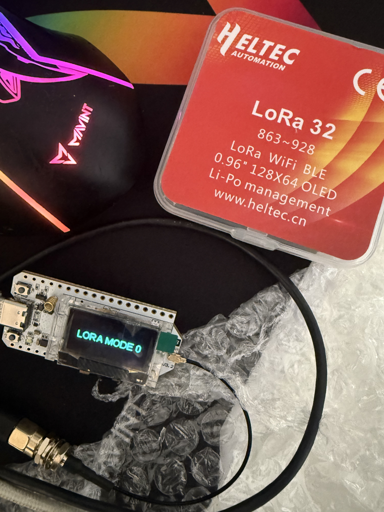
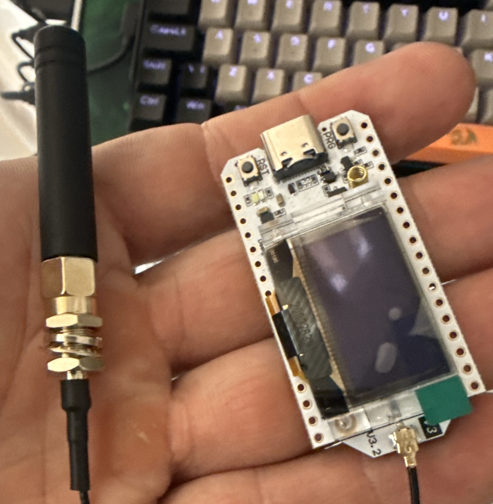
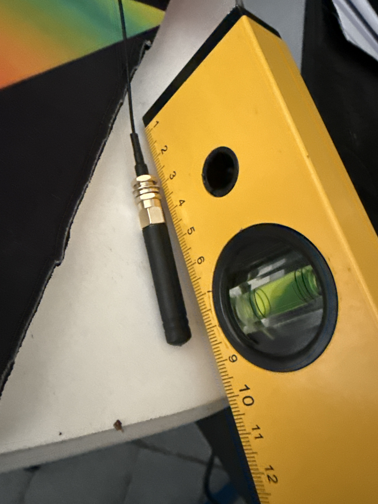

# 📡 Heltec WiFi LoRa 32 V3

### Setup Arduino IDE + Exemplo LoRa TX/RX com OLED (Brasil – 915 MHz)

Este documento descreve **passo a passo** como configurar o **Arduino IDE** para utilizar a placa **Heltec WiFi LoRa 32 V3**, rodando um **exemplo mínimo de transmissão (TX) e recepção (RX) LoRa**, com **OLED funcionando**, usando **frequência legal no Brasil (915 MHz)**.

Nesse teste vamos usar duas placas Heltec WiFi LoRa 32 V3 identicas, uma como **transmissor (TX)** e outra como **receptor (RX)**.

---

## 🧩 Sobre a placa

### 📌 Modelo

**Heltec WiFi LoRa 32 V3**





### 🏭 Fabricante

**Heltec Automation**
Site oficial: [https://heltec.org](https://heltec.org)

### ⚙️ Principais componentes

| Componente       | Descrição               |
| ---------------- | ----------------------- |
| MCU              | ESP32-S3                |
| Rádio LoRa       | **SX1262**              |
| Display          | OLED 0.96" 128×64       |
| Conectividade    | WiFi + Bluetooth + LoRa |
| Antena           | Conector IPEX / u.FL    |
| Alimentação OLED | Controlada via **VEXT** |

---

## ⚠️ Avisos importantes (LEIA ANTES DE LIGAR)

### 🚨 **NUNCA ligue a placa sem antena LoRa conectada**

* O **SX1262 pode queimar** se transmitir sem antena
* Mesmo testes rápidos podem danificar o estágio RF
* Sempre conecte a antena **ANTES** de alimentar a placa

---

## 📏 Antena LoRa – tamanho correto

O tamanho da antena depende da frequência:

### 📡 915 MHz (Brasil)

* Comprimento elétrico ideal (¼ de onda):

```
≈ 8,2 cm
```



Antenas comerciais de **8 a 9 cm** são ideais.

⚠️ Antenas de 868 MHz funcionam **mal** em 915 MHz
⚠️ Antenas muito curtas reduzem alcance e eficiência


---

## 🇧🇷 Frequência LoRa permitida no Brasil

Segundo **ANATEL**, a faixa ISM permitida é:

```
902 MHz – 928 MHz
```

### ✅ Frequência recomendada

```cpp
#define RF_FREQUENCY 915000000
```

### ❌ NÃO use no Brasil

* 433 MHz
* 868 MHz (Europa)

---

## 🛠️ Requisitos de software

* **Arduino IDE 2.x**
* Linux, Windows ou macOS
* Cabo USB-C de dados

Download Arduino IDE:
[https://www.arduino.cc/en/software](https://www.arduino.cc/en/software)

---

## 🧠 Instalação do suporte ESP32

### 1️⃣ Arduino IDE → Preferences

Adicione em **Additional Boards Manager URLs**:

```text
https://raw.githubusercontent.com/espressif/arduino-esp32/gh-pages/package_esp32_index.json
```

---

### 2️⃣ Boards Manager

* Abra **Tools → Board → Boards Manager**
* Procure por **esp32**
* Instale:

```
esp32 by Espressif Systems
```

✔ Versões recomendadas:

* 2.0.14
* 2.0.17

---

## 📦 Biblioteca correta (CRÍTICO)

### ✅ Instale APENAS

```
Heltec ESP32 Dev-Boards
```

Autor: **Heltec Automation**

Essa biblioteca **já inclui**:

* Driver SX1262
* Controle VEXT
* OLED
* Pinagem correta da V3

---

### ❌ NÃO instale / NÃO use

* Heltec_ESP32_LoRa_v3 (terceiros)
* RadioLib separado
* LoRa.h
* Outras libs OLED

Misturar bibliotecas **gera crash, Guru Meditation e conflitos de display**.

---

## 🧩 Seleção da placa

### Tools → Board

```
Heltec WiFi LoRa 32 (V3)
```

### Configurações recomendadas

| Opção            | Valor   |
| ---------------- | ------- |
| USB CDC On Boot  | Enabled |
| Flash Frequency  | 80 MHz  |
| Flash Mode       | QIO     |
| Partition Scheme | Default |
| Upload Speed     | 921600  |

---

## 🔌 Conexão

1. Conecte a **antena LoRa**
2. Conecte o **USB-C**
3. Selecione a porta correta em **Tools → Port**

---

## 📡 Exemplo mínimo – TRANSMISSOR (TX)


Arquivo: `tx.ino`

```cpp
#include "LoRaWan_APP.h"
#include "HT_SSD1306Wire.h"

#define RF_FREQUENCY 915000000

SSD1306Wire display(0x3C, 500000, SDA_OLED, SCL_OLED, GEOMETRY_128_64, RST_OLED);

static RadioEvents_t RadioEvents;

void OnTxDone() {
  Serial.println("TX done");
}

void setup() {
  Serial.begin(115200);

  pinMode(Vext, OUTPUT);
  digitalWrite(Vext, LOW);
  delay(100);

  display.init();
  display.clear();
  display.drawString(0, 0, "LoRa TX");
  display.drawString(0, 12, "915 MHz BR");
  display.display();

  Mcu.begin(HELTEC_BOARD, SLOW_CLK_TPYE);

  RadioEvents.TxDone = OnTxDone;
  Radio.Init(&RadioEvents);

  Radio.SetChannel(RF_FREQUENCY);
  Radio.SetTxConfig(
    MODEM_LORA,
    14, 0, 0, 7, 1, 8,
    false, true, 0, 0, false, 3000
  );
}

void loop() {
  const char *msg = "HELLO LORA";
  Radio.Send((uint8_t *)msg, strlen(msg));

  display.clear();
  display.drawString(0, 0, "TX:");
  display.drawString(0, 12, msg);
  display.display();

  delay(2000);
}
```

---

## 📥 Exemplo mínimo – RECEPTOR (RX)

Arquivo: `rx.ino`

```cpp
#include "LoRaWan_APP.h"
#include "HT_SSD1306Wire.h"

#define RF_FREQUENCY 915000000

SSD1306Wire display(0x3C, 500000, SDA_OLED, SCL_OLED, GEOMETRY_128_64, RST_OLED);

static RadioEvents_t RadioEvents;

void OnRxDone(uint8_t *payload, uint16_t size, int16_t rssi, int8_t snr) {
  payload[size] = 0;

  Serial.printf("RX: %s RSSI=%d\n", payload, rssi);

  display.clear();
  display.drawString(0, 0, "RX:");
  display.drawString(0, 12, (char*)payload);
  display.drawString(0, 30, "RSSI:");
  display.drawString(40, 30, String(rssi));
  display.display();

  Radio.Rx(0);
}

void setup() {
  Serial.begin(115200);

  pinMode(Vext, OUTPUT);
  digitalWrite(Vext, LOW);
  delay(100);

  display.init();
  display.clear();
  display.drawString(0, 0, "LoRa RX");
  display.drawString(0, 12, "915 MHz BR");
  display.display();

  Mcu.begin(HELTEC_BOARD, SLOW_CLK_TPYE);

  RadioEvents.RxDone = OnRxDone;
  Radio.Init(&RadioEvents);

  Radio.SetChannel(RF_FREQUENCY);
  Radio.SetRxConfig(
    MODEM_LORA,
    0, 7, 1, 0, 8, 0,
    false, 0, true, 0, 0, false, true
  );

  Radio.Rx(0);
}

void loop() {
  Radio.IrqProcess();
}
```

---

## ✅ Teste final

1. Grave **RX** em uma placa
2. Grave **TX** na outra
3. Ambas em **915 MHz**
4. OLED mostra TX / RX
5. Serial Monitor confirma pacotes

---

## 🧠 Conclusão

* A **Heltec WiFi LoRa 32 V3 funciona perfeitamente**
* O segredo é **usar só a biblioteca oficial**
* VEXT + OLED + SX1262 **já estão resolvidos**
* Frequência correta e antena correta evitam dor de cabeça
